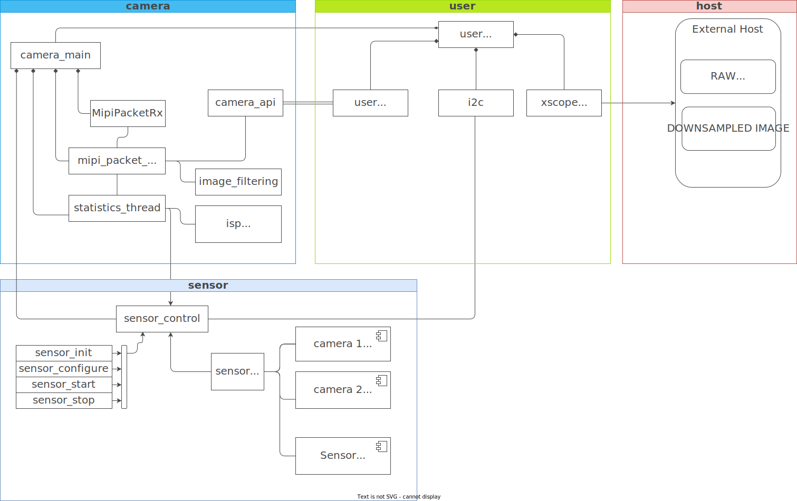

Architecture and Design
=======================

.. include:: ../substitutions.rst

Introduction
-------------

In this section we describe the main components of fwk_camera and how they interact with each other. We also describe the design decisions that were made and the reasoning behind them. The main components of fwk_camera are the following:

Hardware Architecture
----------------------
From a Hardware point of view, fwk_camera is composed of the following modules:
1. 

Software Architecture
-------------------------
From a Software point of view, fwk_camera is composed of the following modules:

   Object Diagram

Module description:
   1. camera section: the camera section takes care of start, process and stop the camera. 
   It has to be aware of the sensor configuration (in sesnor section) and meet the user demands (in user section).

   2. user   section: the user section is the interface between the user and the camera, where we define what we want to do with the frames. 
   3. sensor section: configuration and control of the sensor.
   4. (host) section: provide the interface to write the frames or files to the host.

There are other sections not mentioned in the diagram, as the test section, which is used to test the camera. 

Optimizations and Future Directions
------------------------------------

|TBD|
