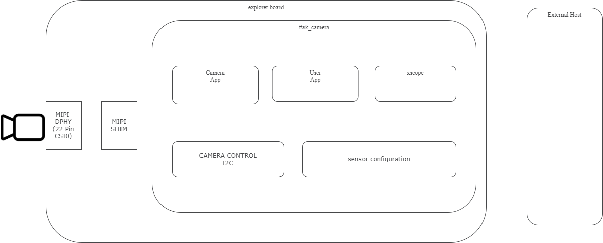

Introduction
=============

The purpose of this programming guide is to provide developers with a comprehensive understanding 
of the |lib_camera| architecture and guide them on how to effectively interact with cameras using the XCORE-AI-EXPLORER board.

Conventions and Terminology
---------------------------
To ensure clarity and consistency throughout this guide, the following conventions and terminology are used:

- MIPI: Mobile Industry Processor Interface. It is a standard interface specification for mobile devices, including cameras. The |lib_camera| architecture utilises MIPI specifications for camera communication.
- xcore: XMOS proprietary event-driven processor architecture. It provides high-performance parallel processing capabilities and is used in XMOS devices to handle camera interface and data processing.
- Channels: In the context of XMOS devices, channels are communication pathways that allow data exchange between different components. Channels play a crucial role in camera control and data transfer within the |lib_camera| architecture.
- I2C: Inter-Integrated Circuit. It is a widely used serial communication protocol for controlling and configuring devices. Within the |lib_camera| architecture, I2C is utilised for camera control operations, such as adjusting settings and retrieving sensor information.

Features
---------
The XCORE-AI-EXPLORER board features an 15-pin MIPI CSI2 port (compatible with Raspberry PI). 
This port is connected to the xcore.ai processor, so an image can be processed directly from an external sensor and have various operations performed over it,
such as converting a RAW image to an RGB image (applying ISP functions),
analyzing the image using AI models with xmos-ai-tools,
converting a MIPI camera to other interfaces as USB, SPI, etc.

The |lib_camera| alongside with the Explorer board architecture provides the following features:

- MIPI CSI2 interface
- Up to 1 Gbps per lane
- Low-resolution filtering
- Supported cameras: `IMX219`_

This repository contains a set of tools for image acquisition, processing, and transmission. 
The architecture, viewed from a high level, is composed of the following elements:

  High-level block diagram of the |lib_camera|.

1. Camera hardware and interface
2. Camera drivers
3. Camera application
4. Sensor configuration
5. Camera output

Each of these elements is described in detail in the following sections.

Getting Started
----------------

A Quick Start Guide is provided with this document. 
It contains a step-by-step guide on how to get started with the |lib_camera| and run a basic ``image_capture`` example.
Please refer to :doc:`03_Building_and_running_the_software`

Additional Resources
---------------------

- MIPI CSI-2 specification:     `MIPI`_
- XMOS I2C library user guide:  `XMOS I2C`_
- XMOS Programming Guide:       `XMOS Programming Guide`_
- Sony IMX219 datasheet:        `IMX219`_
