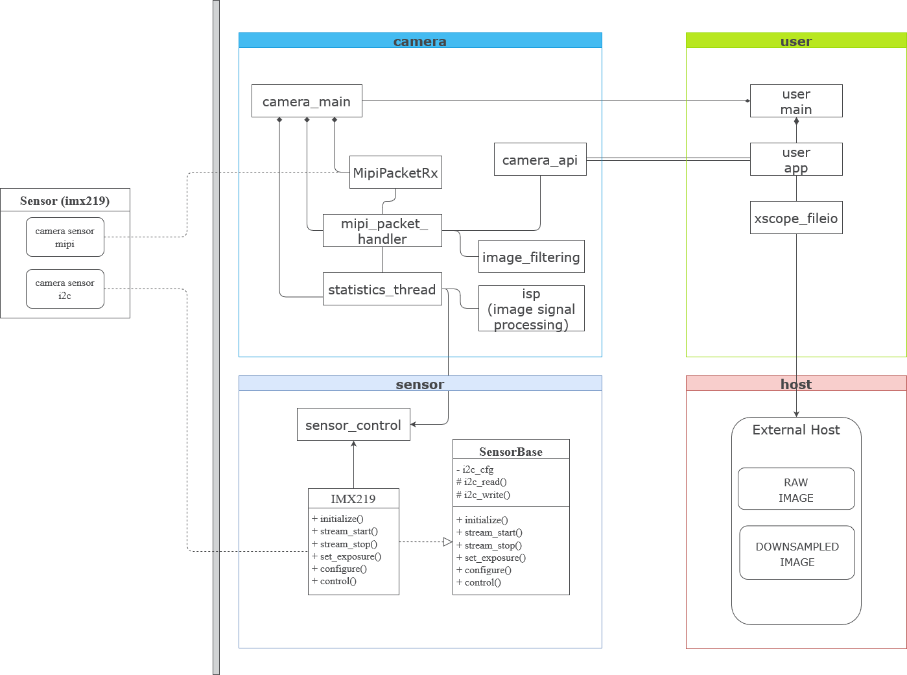

Architecture and Design
=======================

.. include:: ../substitutions.rst
  
In this section we describe the main components of ``fwk_camera`` and how they interact with each other.
We also describe the design decisions that were made and the reasoning behind them.
The main components of ``fwk_camera`` are the following:

Hardware Architecture
---------------------
From a Hardware point of view, ``fwk_camera`` is composed of the following modules:

#.  Camera connector : 15-PIN MIPI CSI connector for the camera module. (compatible with Raspberry Pi).
#.  Mipi Shim : Xmos MIPI hardware to convert MIPI signals to Xcore ports.
#.  Xcore : Xmos Xcore processor to process the MIPI signals.
#.  xTag Host connector : USB connector to connect to the host.

Software Architecture
---------------------
From a Software point of view, ``fwk_camera`` is composed of the following modules:

.. _obj_diagram:

  Object Diagram

Module description:

#.    Camera section: the camera section takes care of start, process and stop the camera. It has to be aware of the sensor configuration (in sensor section) and meet the user demands (in user section).
#.    User section: the user section is the interface between the user and the camera, where we define what we want to do with the frames. 
#.    Sensor section: configuration and control of the sensor.
#.    Host section: provide the interface to write the frames or files to the host.

There are other sections not mentioned in the diagram, as the test section, which is used to test the camera. 
