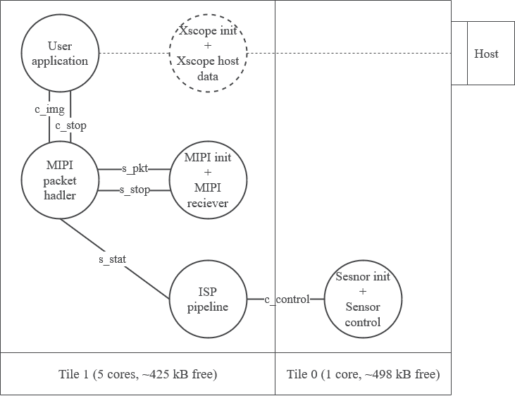

Resource usage
==============

Resource usage will be dependant on the user's application. Here ``take_picture_downsample`` will be taken as an example. It should demonstrate the
minimum resource usage for taking a picture and streaming it to the host machine.

Core usage
----------

``take_picture_downsample`` application thread diagram can be found below. For more detals about thread commutication, please refer to
:ref:`Software Architecture<obj_diagram>` section.

  Resource usage

Here you will notice that the ``xscope_fileio`` related resources are dashed. The reason for that is that you are not likely to use ``xscope_fileio``
in your application. We use it in this example because it's a good testing/debugging tool. So, realistically, for the minimum camera application
you will need 4 cores on tile 1.

Here the ``xscope_fileio`` related resources are dashed. The reason for that is that the users are not likely to use ``xscope_fileio``
in their application. It's been used in this example because it's a good testing/debugging tool. So, realistically, for the minimum camera
application users should be looking at using 4 cores on tile 1.

Memory Usage
------------

More accurate memory report can be found below.

.. code-block:: console

  Constraint check for tile[0]:
    Memory available:       524288,   used:      14084 .  OKAY
      (Stack: 748, Code: 11692, Data: 1644)
  Constraints checks PASSED.
  Constraint check for tile[1]:
    Memory available:       524288,   used:      88896 .  OKAY
      (Stack: 62900, Code: 16284, Data: 9712)
  Constraints checks PASSED.
