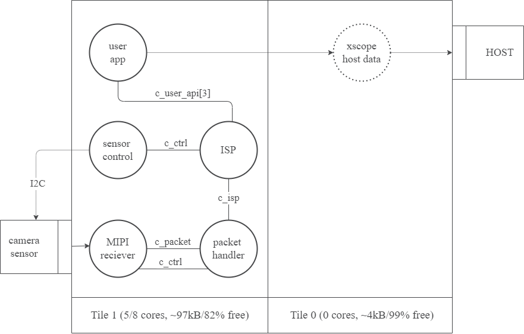

Resource usage
==============

Resource usage will be dependant on the user's application. Here ``take_picture_downsample`` will be taken as an example. It should demonstrate the
minimum resource usage for taking a picture and streaming it to the host machine.

Core usage
----------

``take_picture_downsample`` application thread diagram can be found below. For more detals about thread commutication, please refer to
:ref:`Software Architecture<obj_diagram>` section.

  Resource usage

In the provided context, the resources related to ``xscope_fileio`` are represented with dashes. This decision is based on the assumption that ``xscope_fileio`` is unlikely to be utilized within your application. The inclusion of ``xscope_fileio`` in this example is primarily for testing and debugging purposes. Consequently, for the minimum camera application, a requirement of 4 cores on tile 1 is necessary.

Memory Usage
------------

A more accurate memory report can be found below.

.. code-block:: console

  Constraint check for tile[0]:
  Memory available:       524288,   used:       4068 .  OKAY
    (Stack: 356, Code: 3180, Data: 532)
  Constraints checks PASSED.
  Constraint check for tile[1]:
  Memory available:       524288,   used:      95720 .  OKAY
    (Stack: 62844, Code: 20832, Data: 12044)

.. note:: 
  
  The memory usage below is based on the ``take_picture_downsample`` application. The memory usage will vary depending on the application.
  
