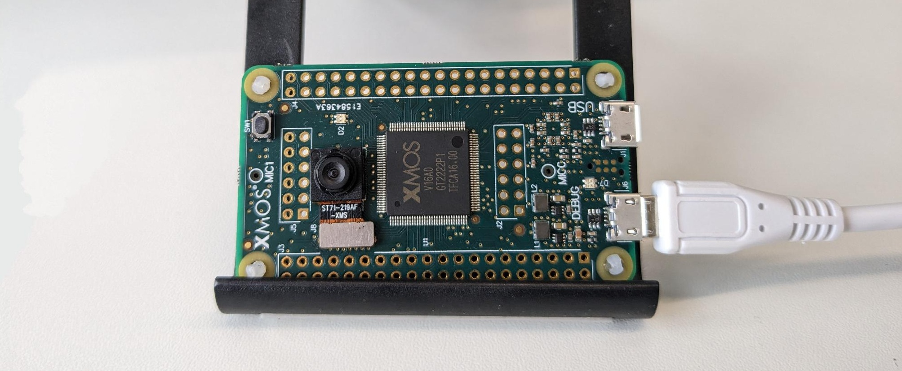

|newpage|

.. _lib_camera_getting_started:

Getting Started
===============

This section provides a quick-start guide to help users get up and running with the library. It includes information on hardware and software requirements, installation instructions, and a minimal working example that captures a frame from the camera.

.. note::

   To directly go to the instructions for building and running the example, refer to :ref:`Build and Run the Application <Build and Run the Application>` section.

RGB Capture Example
-------------------

The following example demonstrates how to use the library to capture a frame from the camera and save it to a file. The example is located in the ``examples`` directory of the library source code.

The example consists of two main files:

- ``mapfile.xc``: This file contains the entry point to the application (main). On one hand, it initialises the ``camera_main`` thread. On the other hand, it starts the ``user_app`` thread. ``camera_main`` is part of the camera library and is responsible for initialising the camera, configuring the camera settings, and starting the camera capture process. It also handles the MIPI receiver thread and the ISP thread. The ``user_app`` thread is responsible for processing the image data after it has been captured. Both communicate via the channel ``c_cam``. For more information on XMOS channels, refer to the `XMOS XC Programming Guide`_ and the C version `XMOS C Programming Guide`_.

.. literalinclude:: ../../examples/capture_rgb/src/mapfile.xc
   :language: c
   :start-at: int main(void)
   :end-at: return 0;

- ``user_app.c``: This contains the user_app thread, which is responsible for setting the buffer where the image data will be stored and for processing the image data after it has been captured. Image size and properties are user centric, meaning that the user can set the image size and properties according to their needs. The library will then handle the conversion of the image data to the desired format.

.. literalinclude:: ../../examples/capture_rgb/src/user_app.c
   :language: c
   :start-at:  // Image and configuration
   :end-before: save_image(&image, FILE1_NAME);

First, the user must define the objects :c:struct:`camera_cfg_t` and :c:struct:`image_cfg_t`. The ``camera_cfg_t`` struct contains the camera configuration parameters, such as offsets to define the region of interest and the acquisition mode. The ``image_cfg_t`` struct contains the image data and properties, such as width, height, a pointer to the image buffer, and a pointer to the previously declared configuration. In the example, the user expects an image of 200x200x3 RGB int8 image. 

Next, the user must call the :c:func:`camera_isp_coordinates_compute` function, which takes a pointer to ``image_cfg_t``. This call computes the coordinates of the region of interest (ROI) based on the camera configuration (``camera_cfg_t``) and the capture mode. In this case, it will be captured in RGB format and downsampled by a factor of 2 and starting at position (0,0).

The function :c:func:`camera_isp_coordinates_compute` only needs to be called once if the user does not change the image size or properties. It needs to be called again each time image size, format or properties are changed.

Finally, the user must call the :c:func:`camera_isp_start_capture` function to start the camera capture process. When the user needs the frame, they can call the :c:func:`camera_isp_get_capture` function. This function will block until the frame is ready.

Once the frame is ready, the user can process the image data and save it to a file using the ``save_image()`` function.

The following sections provide detailed information about the requirements for running the example, as well as step-by-step instructions on how to build and execute it.

.. _Build and Run the Application:

Hardware Requirements
---------------------

The library is designed to work with the following hardware:

- |vision board| (|vision board ref|).
- 1x Micro USB cable.

Hardware Setup
--------------

- Plug the 1x Micro USB cable to both the host computer and the ``DEBUG`` Micro USB port.
- Face the |vision board| horizontally, with the camera connector looking down.

:numref:`Setup` shows the hardware setup for the example:

.. _Setup:

   Hardware Setup for the |vision board|

Software Requirements
---------------------

The following software is required to build and run the library:

- XTC tools: |xtc_tools_version| `XTC tools`_.
- Python: |python_version| or later Python_.
- CMake: |cmake_version| or later CMAKE_.

Software Setup
--------------

Before building the example, ensure that the ``XTC tools`` are installed and properly activated in your development environment (`XTC tools`_). This can be verified by running the following command in a terminal with the XTC tools sourced:

.. code-block:: console

   xcc --version

This command should display the version of the installed ``XTC tools``. If the tools are not installed or activated, refer to the installation instructions in the documentation.

Once done, run the following commands from the root of the library:

.. code-block:: console

   # install python dependencies
   pip install -r requirements.txt
   # go to example folder
   cd examples/capture_rgb
   # build
   cmake -G "Unix Makefiles" -B build
   xmake -C build

If the build is successful, the message ``[100%] Built target capture_rgb`` and the usage report will be displayed:

.. list-table:: Memory Usage Per Tile
   :align: center

   * - Tile
     - Memory Used
     - Status
   * - tile[0]
     - 4236 / 524288
     - OKAY
   * - tile[1]
     - 170692 / 524288
     - OKAY

Note that the memory usage is shown in bytes, and results could differ slightly. The maximum memory available for each tile is 524288 bytes. As we can see in this case, the memory usage is well within the limits for both tiles. Usage is about 0.81% of the total memory available for tile 0 and about 32% for tile 1. 

Once the example is built, you can run it using the following command:

.. code-block:: console

   # run 
   xrun --xscope bin/capture_rgb.xe
   # decode image
   python decode.py

This will run the example, save the image to a binary file, and then the python script will decode the image and display it.

To go further, uncomment the following lines in the ``user_app.c`` and re-run the file:

.. literalinclude:: ../../examples/capture_rgb/src/user_app.c
   :language: c
   :start-at:  /* (Optional) try something out of bounds
   :end-before: exit(0);

This will try to apply an offset > 1.0 and will cause an error. The error will be displayed in the terminal, and the program will exit with an error code.

.. code-block:: console

   xrun: Program received signal ET_ECALL, Application exception.
   0x00081ad6 in camera_isp_coordinates_compute (img_cfg=0xe2a2c) at ...camera_isp.c:216

The line that raised the error, corresponds to the following:

.. literalinclude:: ../../lib_camera/src/isp/_camera_isp.c
   :language: c
   :start-at:  xassert(cfg->x2 <= SENSOR_WIDTH && "x2");
   :end-at: xassert(cfg->y2 <= SENSOR_HEIGHT && "y2");

As we can see, the error is raised because the offset is greater than the image size. Offset has to be a valid range in float from 0.0 to 1.0.

Related Documentation
---------------------

The following application notes provide additional information about the library and how to use it with other XMOS libraries:

* AN02005: *Xmos Logo Detector*
* AN02010: *Face Identification on xcore.ai*
* AN02013: *FaceId And Keyword Spotting*
