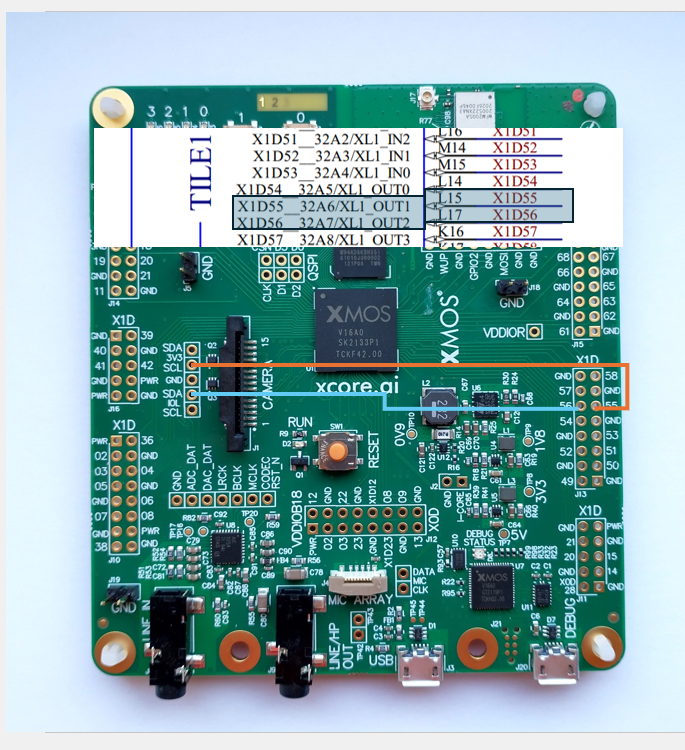
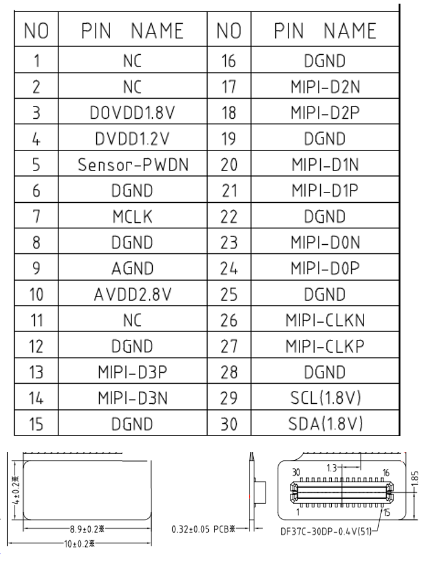

|newpage|

.. _lib_camera_configuration:

Configuration
=============

This section provides guidance on configuring the xcore.ai camera library for a variety of hardware platforms and use cases. It covers the main configuration structures, logging options, default settings, and steps required to adapt the library for different boards and sensors.

.. contents::
   :local:
   :class: this-will-duplicate-information-and-it-is-still-useful-here

Logging Options
---------------

The library provides a logging mechanism to help developers debug and monitor the camera's operation. The logging options are available via CMake options. The following options are available:

- -DDEBUG_PRINT_ENABLE_CAM_ISP=1 : This option enables debug prints for the ISP thread. It can be used to monitor the status of the ISP and its components.
- -DDEBUG_PRINT_ENABLE_CAM_MIPI=1 : This option enables debug prints for the MIPI thread. It can be used to monitor the status of the MIPI receiver and its components.
- -DCONFIG_APPLY_AE=1: This option enables the application of automatic exposure (AE) settings. It can be set to 0 to disable AE.
- -DCONFIG_APPLY_AWB=1: This option enables the application of automatic white balance (AWB) settings. It can be set to 0 to disable AWB.
- -DLIBXCORE_XASSERT_IS_ASSERT=1 : This option configures the library to use the standard ``assert`` C standard library instead of ``lib_xcore/xassert`` for runtime exceptions. Enabling this provides more detailed error reporting, as ``assert`` outputs information about the error location, while ``xassert`` does not.

Default Settings
----------------

The main default settings can be found in the ``camera.h`` file. The following settings are available:

.. literalinclude:: ../../lib_camera/api/camera.h
   :language: c
   :start-at:  // High-Level Sensor Configuration
   :end-before: /**

This chooses the default settings and options for the camera library. This configuration will impose some constraints that are suitable for most applications, but can be modified to suit specific needs. 

Image Configuration
-------------------

The primary structure used to configure these options is through `camera_cfg_t` for camera-specific settings and `image_cfg_t` for image-related settings. For more details on these structures, please refer to the API section :ref:`lib_camera_api_reference`.

Below is an example configuration:

.. code-block:: c

    camera_cfg_t config = {
        .offset_x = 0.2,
        .offset_y = 0.3,
        .mode = MODE_RGB2,
    };

    image_cfg_t image = {
        .height = 192,
        .width = 240,
        .channels = 3,
        .size = h * w * ch,
        .ptr = &image_buffer[0],
        .config = &config
    };

In this example, the user has set the image size to 192x240 pixels with 3 channels (RGB). The `ptr` field points to the buffer where the image data will be stored. The `config` field points to the camera configuration structure, which contains additional settings such as offsets and modes. In this case ``MODE_RGB2`` is selected, meaning that the image will take a region of 384x480 pixels from the sensor area to produce a 192x240 image. The offsets are set to 0.2 and 0.3, which means that the image will start from 20% and 30% of the sensor's maximum area.

Adding Support for the xcore.ai Evaluation Kit
----------------------------------------------

The |explorer board| (|explorer board ref|) is a development board that can be used with the xcore.ai camera library, it has a compatible FPC-24 connector and a MIPI D-PHY receiver. It can support cameras like the Raspberry Pi camera module v2.1 (IMX219) directly. The main difference is the board layout, in the |explorer board|, I2C and MIPI lines collide in the same tile, so the user will need to adapt the hardware or software to make it work.

Regarding the **Hardware solution**, the user can route free pins on tile[1] to the I2C signals from tile [0] (SCL:X0D37:D16, SDA:X0D38:D17). This allows reuse of the same code as used for the |vision board|. MIPI can be placed in both tiles, with the only restriction that MIPI and USB can't be placed on the same tile. The specific ports and pin assignments for the board can be found in the corresponding ``.xn`` file and the board's manual. :numref:`expl-board-conn` illustrates how to achieve this:

.. _expl-board-conn:

  |explorer board| I2C connections

In this configuration, free pins on tile[1] (X1D56, X1D57) are used to connect the I2C signals from tile[0] (SDA, SCL respectively). 

Regarding the **Software solution**, the user will need to adapt the code to work with the |explorer board|. The following sections provide a guide on how to do this. The first change is to adapt the entry point of the program as follows:

.. tab:: Vision Board

    .. code-block:: c

        #define  SCL_BIT_POS  0x1
        #define  SCL_BIT_MASK 0xC
        #define  SDA_BIT_POS  0x0
        #define  SDA_BIT_MASK 0xC

        on tile[1]: camera_main(c_cam);
        on tile[1]: user_app(c_cam);

.. tab:: |explorer board|

    .. code-block:: c

        #define CAMERA_MIPI_TILE 1
        #define CAMERA_I2C_TILE  0

        #define  SCL_BIT_POS  0x0
        #define  SCL_BIT_MASK 0x0
        #define  SDA_BIT_POS  0x0
        #define  SDA_BIT_MASK 0x0

        on tile[CAMERA_MIPI_TILE]: camera_main(c_cam, c_i2c);
        on tile[CAMERA_MIPI_TILE]: user_app(c_cam);
        on tile[CAMERA_I2C_TILE]: camera_sensor_control_rx(c_i2c);

The main difference is that in the |vision board| the I2C and MIPI are on the same tile, so the sensor control object can be called directly as a function, while in the |explorer board|, the I2C and MIPI ports are on different tiles, therefore the user will need to create a new thread (in the example ``camera_sensor_control_rx``) to handle the I2C control, and both threads will communicate via a channel (in the example, ``c_i2c``).

To enable this, the ``camera_main`` function needs to accept a second channel parameter, ``c_i2c``. This channel is used for communication between the ISP thread and the I2C control thread, and should be passed to ``camera_isp_thread``.

.. code-block:: c

   void camera_main(chanend_t c_cam, chanend_t c_i2c) {
    /*
    .....
    */
    PAR_JOBS(
        PJOB(camera_mipi_rx, (ctx.p_mipi_rxd, ctx.p_mipi_rxa, c_pkt.end_a, c_ctrl.end_a)),
        PJOB(camera_isp_thread,(c_pkt.end_b, c_ctrl.end_b, c_cam, c_i2c))
    );

Instead of calling the ``camera_sensor_control`` function directly, the ISP calls the ``camera_sensor_control_tx`` function, which sends the command to the I2C control thread via the ``c_i2c`` channel.

.. tab:: Vision Board

  .. code-block:: c

    camera_sensor_init();

.. tab:: Explorer Board

  .. code-block:: c

    camera_sensor_control_tx(SENSOR_INIT, 0);

The ``camera_sensor_control_rx`` thread will be responsible for handling the I2C control commands and sending them to the sensor.
Below is a definition of what the ``camera_sensor_control_rx`` thread could look like:

.. code-block:: c

   void camera_sensor_control_rx(chanend_t c_control){
     uint32_t encoded_response;
     sensor_control_t cmd;
     uint8_t arg;
     int ret = 0;

     SELECT_RES(
       CASE_THEN(c_control, c_control_handler))
     {
       c_control_handler: {
         encoded_response = chan_in_word(c_control);
         cmd = (sensor_control_t)DECODE_CMD(encoded_response);
         arg = DECODE_ARG(encoded_response);
         switch (cmd)
         {
         case SENSOR_INIT:
           camera_sensor_init(); break;
         // ...
         }
         assert((ret == 0) && "Could not perform I2C write");
       }
     }
   }

   void camera_sensor_control_tx(chanend_t c_control, sensor_control_t cmd, uint8_t arg) {
     uint32_t encoded_command = ENCODE_CTRL(cmd, arg);
     chan_out_word(c_control, encoded_command);
   }

After implementing the above changes, the user will need to rebuild the application. The user can then run the example and verify that the camera is working correctly.

Adding Support for Other Boards
-------------------------------

The xcore.ai camera library is designed to work with the supported hardware listed in the :ref:`lib_camera_supported_hardware` section. However, it can be adapted to work with other boards that meet the minimum hardware requirements.

If the board meets these requirements, it may be necessary to adapt either the hardware or software configuration, depending on the board's architecture.

If both MIPI and I2C interfaces are available on the same tile, the code for the |vision board| can generally be reused. Update the XN file and adjust the I2C port initialisation as needed, typically found under the ``sensor`` folder.

If MIPI and I2C are located on separate tiles, follow the approach described in the previous section for the |explorer board|. This involves creating a dedicated thread for I2C control and establishing inter-tile communication via channels.

Additionally, ensure that the MIPI connector meets D-PHY specifications and that I2C lines are correctly routed to the appropriate pins for the custom board. Board-specific configuration may require further adjustments to the hardware description and initialisation code.

Adding a New Sensor
-------------------

This section describes how to add a new sensor to the xcore.ai camera library.
It covers both hardware and software aspects, including the necessary steps to ensure compatibility and functionality.

First, the user will need to see if their sensor is compatible with the |vision board|.

The sensor has to:

- Support MIPI CSI2 protocol
- Be driven from a 3.3V source
- Have a compatible FPC-24 camera connector.

:numref:`vision_board_fpc` shows the pinout of the 24-pin FPC connector on the |vision board|:

.. _vision_board_fpc:

  
  FPC-24 connector pinout

Once a compatible sensor is available, the user will need to adapt the software. 

By navigating to ``sensors/api/SensorBase.hpp``, the user will find the ``SensorBase`` class which is intended to be derived from.
It doesn't have anything to do with a particular sensor, it only provides an API to do basic I2C communication with the sensor.
Inside ``SensorBase`` class users can also find some public virtual methods which will have to be implemented in the derived class.

In order to implement a new sensor, the user will need to create a directory in ``lib_camera/src/sensors``, implement a derived class with 
``initialize()``, ``stream_start()``, ``stream_stop()``, ``set_exposure()``, ``configure()`` and ``control()`` methods.

After that's been done, the user will need to rebuild the application. 
